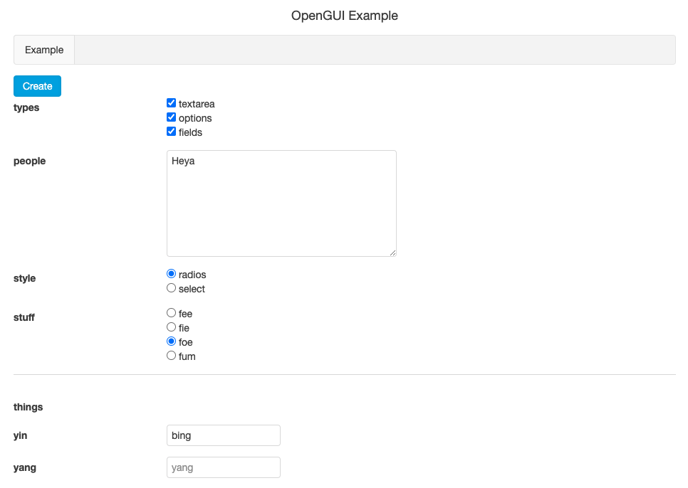

opengui
=======

Library for building dynamic forms, forms whose options and even fields change based on values in other fields.

This doesn't involve rendering dynamic forms, just making creating and altering the structures thereof.

# Example

Some Python code in [service.py](api/lig/service.py) that generate some basic field dynamically

```python

# Create a single multi select field

fields = opengui.Fields(
    values=values,
    fields=[
        {
            "name": "types",
            "options": [
                "textarea",
                "options",
                "fields"
            ],
            "multi": True,
            "trigger": True
        }
    ]
)

# If they select textarea, add it

if "textarea" in (fields["types"].value or []):
    fields.append({
        "name": "people",
        "style": "textarea"
    })
    fields.ready = True

# If they selected option, add a format, then check what format they selected

if "options" in (fields["types"].value or []):
    fields.append({
        "name": "style",
        "options": [
            "radios",
            "select"
        ],
        "default": "radios",
        "trigger": True
    })
    fields.append({
        "name": "stuff",
        "options": [
            "fee",
            "fie",
            "foe",
            "fum"
        ],
        "style": fields["style"].value
    })
    fields.ready = True

# If they add subfields, add two, and make the second optional

if "fields" in (fields["types"].value or []):
    fields.append({
        "name": "things",
        "fields": [
            {
                "name": "yin",
            },
            {
                "name": "yang",
                "optional": True
            }
        ]
    })
    fields.ready = True

# Retrn as a dict

return fields.to_dict(), 200
```

Universal [doTRoute.js](http://gaf3.github.io/dotroute/) [form.html](gui/www/form.html) to display a dynamic form:

```html
{{?it.message}}
<div class="uk-alert uk-alert-success">
    {{=it.message}}
</div>
{{?}}
{{?it.errors && it.errors.length}}
<div class="uk-alert uk-alert-danger">
    {{~it.errors :error}}
        {{=error}}<br/>
    {{~}}
</div>
{{?}}
<form class="uk-form uk-form-horizontal">
    {{= DRApp.templates.Fields(it) }}
    <br/>
</form>
```

Universal [doTRoute.js](http://gaf3.github.io/dotroute/) [fields.html](gui/www/fields.html) to display all sorts of combinations, including sub fields:

```html
{{~it.fields :field}}
    {{ var prefix = it.prefix || []; }}
    {{ var full_name = prefix.concat(field.name).join('-').replace(/\./g, '-'); }}
    {{ var value = field.value || field.default || (field.multi ? [] : ''); }}
    {{ var readonly = field.readonly || it.readonly; }}
    {{?field.fields || field.name == "yaml"}}
    <div class="uk-form-row"><hr/></div>
    {{?}}
    <div class="uk-form-row">
        <label class="uk-form-label" for="{{=field.name}}"><strong>{{=field.label || field.name}}</strong></label>
        <div class="uk-form-controls">
    {{?field.style == "textarea"}}
        {{?readonly}}
            {{?field.name == "yaml"}}<pre>{{?}}{{=value}}{{?field.name == "yaml"}}</pre>{{?}}
        {{??}}
            <textarea
                rows='7' cols='42'
                id="{{!full_name}}"
                placeholder="{{!field.label || field.name}}"
                {{?field.trigger}}OnInput="DRApp.current.controller.fields_change();"{{?}}
            >{{=value}}</textarea>
        {{?}}
    {{??field.style == "select" && !readonly}}
            <select id="{{!full_name}}" {{?field.trigger}}OnChange="DRApp.current.controller.fields_change();"{{?}}>
        {{?field.optional}}
                <option value=''></option>
        {{?}}
        {{~field.options :option}}
                <option value='{{!option}}' {{?value == option}}selected{{?}}>
                    {{= field.labels ? field.labels[option] : option}}
                </option>
        {{~}}
            </select>
    {{??field.options}}
        {{?readonly}}
            {{?field.multi}}
                {{~value :option}}
            {{= field.labels ? field.labels[option] : option}}<br/>
                {{~}}
            {{??}}
            {{= field.labels ? field.labels[value] : value}}<br/>
            {{?}}
        {{??}}
            {{~field.options :option}}
            <input
                value="{{!option}}"
            {{?field.multi}}
                type="checkbox" name="{{!full_name}}"
                {{?value.indexOf(option) > -1}}checked{{?}}
            {{??}}
                type="radio" name="{{!full_name}}"
                {{?value == option}}checked{{?}}
            {{?}}
                {{?field.trigger}}OnClick="DRApp.current.controller.fields_change();"{{?}}
            />
            {{= field.labels ? field.labels[option] : option}}<br/>
            {{~}}
        {{?}}
    {{??!field.fields}}
        {{?readonly}}
            {{= field.style == "datetime" ? (new Date(value*1000)).toLocaleString() : value}}
        {{??}}
            <input
                id="{{!full_name}}"
                placeholder="{{!field.label || field.name}}"
                value="{{!value}}"
                {{?field.trigger}}OnInput="DRApp.current.controller.fields_change();"{{?}}
                type="text"
            />
        {{?}}
            <br/>
    {{?}}
    {{?field.errors}}
            <span class='uk-form uk-text-danger'>
        {{~field.errors :error}}
                {{=error}}
        {{~}}
            </span>
    {{?}}
    {{?field.description}}
            <dfn>{{=field.description.replace(/\n/g, "<br/>")}}</dfn><br/>
    {{?}}
    {{?field.link}}
        {{ var links = Array.isArray(field.link) ? field.link : [field.link]; }}
        {{~links: link}}
            <a href="{{!link.url || link}}" target="{{!link.target || '_blank'}}">{{=link.name || link.url || link}}</a><br/>
        {{~}}
    {{?}}
        </div>
    </div>
    {{?field.fields}}
        {{= DRApp.templates.Fields({fields: field.fields, readonly: readonly, prefix: prefix.concat(field.name)}) }}
    {{?}}
{{~}}
```

Which looks like this:



If you're familer with Docker Desktop, Kubernetes, and Tilt `make up` and hit space.

Navigate to `http://localhost:7971/` and give it a whirl.

# Documentation

It's lacking at this point, but check out the [tests](test_opengui.py) to see what you can do.
